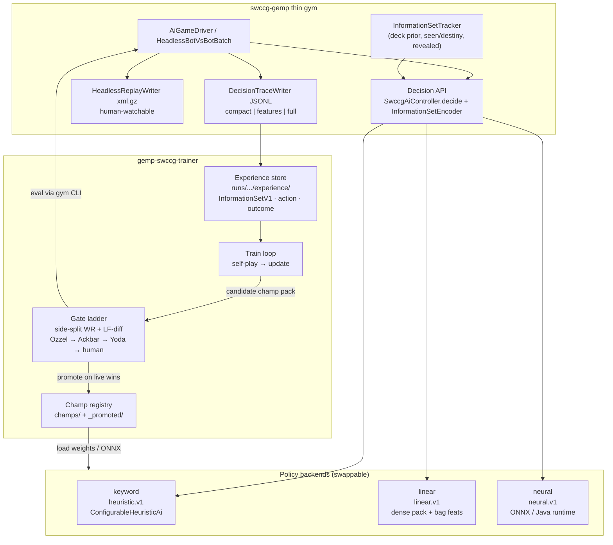
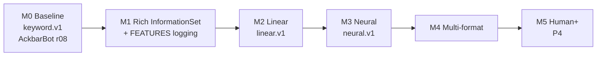

# Design: Learned Policy Path (v1) — Human Competency and Beyond

| Field | Value |
|-------|-------|
| **Author** | Design for Bill Bisco / AckbarBot training (executor draft) |
| **Date** | 2026-10-02; revised same day for rich InformationSet, then for Bill's ratified decisions |
| **Status** | Ratified decisions (2026-10-02). Design document; AckbarBot is not trained by this file. |
| **Thesis** | One durable architecture: gym + Decision API + swappable policy backends + experience store + train loop + gate ladder. Keyword heuristics are a **baseline backend**, not the ceiling. Training starts from a **rich information set** (hand, own deck prior, capped seen-history + in-game aggregates, public board, opponent revealed-only, soft metagame belief) — **not** 43 keyword weights, and **not** a giant flat vector. |
| **Repos** | Trainer: `billbisco/gemp-swccg-trainer` (`/workspace/gemp-swccg-trainer`). Gym hooks: `billbisco/swccg-gemp` (`/workspace/swccg-gemp`, branch `feature/headless-bot-vs-bot`). |
| **Primary format** | `premiere_anh` — WC96 Premiere–ANH sample decks (`decks/wc96-anh-{dark,light}.txt`) |
| **Champ name** | **AckbarBot** = ours (current pack `heuristic.v1` / `heuristic-v1-wc96-r08-blend-adv25`; future `linear.v1` / `neural.v1` keep that name). Versioned handles (**AckbarBot1**, **AckbarBotABC**, …) are OK, with rich metadata in logs. Near-term bar: beat today's GEMP bots (**OzzelBot** = BeginnerAi, then **YodaBot** = AdvancedAi). Hall rename of any legacy AckbarBot can wait. |
| **Stock bots** | OzzelBot = BeginnerAi; YodaBot = AdvancedAi; Rando_Cal = random |
| **Related** | Parent architecture: `/workspace/docs/swccg-bot-trainer-architecture.md`. Gym notes: `swccg-gemp/docs/headless-bot-vs-bot-NOTES.md`. |

---

## Ratified decisions (2026-10-02)

Bill ratified these. They are authoritative. They close the questions that used to sit in §12. Body sections below follow them. Do not treat them as suggestions.

1. **Hybrid features.** Packed `float32[128]` dense summary **plus** sparse bags. Not a giant flat vector.
2. **Gates.** Side-split win rate **and** Life Force differential (mean LF margin from the candidate's seat, split Dark vs Light). W/L is the headline. LF-diff ranks skill under luck and Dark bias (~60–65% DS in many formats). Log final LF for both seats.
3. **Opponent knowledge.** NEVER a 100% exact opponent decklist. Soft metagame belief from similar decks, plus in-game reveals only. Drop `opponentDeckPriorKnown` (exact stock prior). People swap a few cards.
4. **Seen-history.** Cap the recent event log at 32–64 events. Keep full in-game aggregates for important facts (destiny/recycle location, revealed opponent tech such as Battle Order / First Strike). Cross-game soft metagame beliefs are a separate store, not the per-line event dump.
5. **Where learned packs run.** `linear.v1` / learned packs are **gym-cli only** until proven. Hall / table bot later.
6. **No distillation teacher now.** No YodaBot / AdvancedAi distillation. Self-play + gates (WR + LF-diff). Imitation later, when competent humans or strong bots exist.
7. **Human P4 protocol.** Leave undefined in detail for now. Bill will know and Test when ready.
8. **One pack.** One unified AckbarBot pack for both seats (**side is a feature**). DS/LS specialists deferred.
9. **Seeded shuffle.** Implement seeded shuffle as a **tool** with PR-A. **TRAINING and strength gates use RANDOM seeds.** Fixed seeds only for debug/tests. Never promote on a fixed-seed suite alone.
10. **Versioned handles.** AckbarBot1, AckbarBotABC, and similar are OK, plus rich metadata in logs. Hall rename of any legacy AckbarBot can wait.
11. **Name and near-term bar.** Champ name remains **AckbarBot** (ours). Near-term bar: beat today's GEMP bots (OzzelBot, then YodaBot).

---

## 1. Goal & non-goals

### Goal

Ship a **single, durable training architecture** that can reach **P4 = human competency and beyond** on WC96 Premiere–ANH, then extend to multi-format, **without throwing away** the existing headless gym, collect loop, CSV gates, replay xml.gz, or champ-pack bridge.

Phases below are **milestones on that same architecture**, not disposable experiments. What changes over time is the **policy backend** (keyword → linear → neural) and the richness of logged experience—not the gym contract.

**Ambition (Bill):** the bot must play real SWCCG tactics — own deck composition knowledge, always-visible own hand, tracking cards seen (e.g. destiny draws like a 6) for recycle timing (activate more/less, delay battle), combo planning (e.g. wait for Neighboring System leads + Sorry About the Mess to move in Control then shoot), opponent **revealed** cards only (never cheat on unrevealed), and full use of available GEMP information including act-vs-hold and activate-more-vs-less. **Do not shrink ambition to keyword bots.**

Target ladder (promote only on live wins). **Near-term bar: beat today's GEMP bots — OzzelBot, then YodaBot.** Gates are side-split: win rate is the headline, and Life Force differential (mean LF margin from the candidate's seat, Dark vs Light) ranks skill under luck and Dark bias. Log final LF for both seats. Human P4 stays on the ladder, but the protocol is undefined in detail until Bill knows and Tests it.

1. Beat OzzelBot (Beginner) by a clear margin on WC96.
2. Beat current AckbarBot champ (self) — same architecture's self gate, not a substitute for the near-term bar.
3. Beat YodaBot (Advanced) by a clear margin.
4. Hold positive expected value vs competent humans (P4), then improve further. Protocol: undefined for now.

### Non-goals

- Do **not** replace the gym with a Python rules engine or LLM volume path.
- Do **not** discard `heuristic.v1` / ConfigurableHeuristicAi; keep it as Backend A and as a gate opponent forever.
- Do **not** claim collection = learning. Trace JSONL and CSV alone never promote a champ.
- Do **not** redesign Hall UI, Peter Soetens’ browser model, or MCP agents in this doc (external benchmarks only).
- Do **not** require GPU for the first linear milestone; neural may use CPU/ONNX first, GPU later.
- Do **not** peek at hidden info (opponent hand contents, face-down reserve/used order) in the feature schema.
- Do **not** implement Java net inference in this design task—contracts only.
- Do **not** pretend all tactical context fits in a tiny fixed float vector, and do **not** switch to a giant flat vector. Ratified shape is packed `float32[128]` + sparse bags (§3.7).
- Do **not** encode a 100% exact opponent decklist (`opponentDeckPriorKnown` is dropped). People swap a few cards.
- Do **not** distill from YodaBot / AdvancedAi now. Self-play + gates. Imitation later.
- Do **not** promote on a fixed-seed suite. Training and strength gates use random seeds.
- Do **not** ship DS/LS specialist packs now. One AckbarBot pack; side is a feature.
- Do **not** load `linear.v1` / learned packs in Hall or the table bot until gym-cli has proven them.

### Honesty constraint (invariant)

> **Collection ≠ learning.** Promote only when a candidate **passes the gate ladder** (live games in gym). Mutating weights, fitting a linear model, or training a net produces a **candidate**. Gates produce a **champ**.

---

## 2. Durable architecture

Keyword, linear, and neural policies all sit behind the same Decision API. The train loop reads the experience store; the gate ladder never trusts train loss.



### Ownership

| Layer | Repo | Owns |
|-------|------|------|
| Rules, `GameState`, decide loop, InformationSet encoder (Java), policy runtimes, seen-card tracker | `swccg-gemp` | Correctness; no cheating on hidden info; champ load |
| Orchestration, experience indexing, train code (Python), gate scripts, UI | `gemp-swccg-trainer` | Throughput, experiments, promote/reject |
| Schemas (source of truth) | `gemp-swccg-trainer/schemas/` | Versioned JSON Schema; gym copies or mirrors |

### What stays from today

- Headless two-AI loop (`HeadlessBotVsBotRunner` / Batch) — promote to `ai/gym` when ready; keep working from test sources until then.
- CSV batch metrics + parallel JVM workers (`trainer/improve/gym_parallel.py`).
- Champ packs + SHA-256 manifest (`heuristic.v1` today; extend `policyKind`).
- Watch path: summary + JSONL + optional xml.gz (human), separate from learning experience.
- Gate honesty: fail-closed; r08 remains champ until something beats it **and** Beginner.

---

## 3. InformationSet / State feature schema v1

**Purpose:** at every decision, emit the deciding player's **full legal information set** — everything a skilled human would track from GEMP's public + own-private view — plus compact derived proxies for models. Keyword backend may ignore bags; linear/neural consume **dense pack + sparse bags**.

**Ratified shape:** hybrid only — `packed` is `float32[128]`, bags stay sparse. Not a giant flat vector. Opponent deck knowledge is a **soft metagame belief** plus in-game reveals, never the exact opposing list.

**Naming:** the top-level blob is **`InformationSetV1`** (preferred). The packed dense slice is still called `StateFeaturesV1.packed` for short. JSON field `"schemaVersion": 1`. Bumping the schema **invalidates** old linear/neural packs unless a converter exists.

> **Not 43 keyword weights.** PR-A must log rich FEATURES (hands, deck prior, seen/destiny, public zones, legal action space including Pass / activate amounts). Thin scalars-only traces are insufficient for the training path Bill wants.

### 3.1 Perspective & hidden-info rules

| Rule | Detail |
|------|--------|
| Perspective | All relative fields are from `playerId` (decider). Absolute dark/light fields are labeled `dark*` / `light*` and are public. |
| Own private (allowed) | Own hand **titles + blueprintIds**; **own** decklist prior; remaining-composition **estimates** (multiset math — never face-down pile **order**). |
| Opponent deck | **Never** the exact seated list. Soft metagame belief (similar decks) + cards revealed this game. No `opponentDeckPriorKnown`. |
| Visible / public | Own & opponent board (in-play); public pile **sizes**; life force; force generation; objectives if played; phase; turns; whose turn; FD / battle flags; face-up tops when rules reveal them; lost pile when face-up / public; cards already revealed by destiny or effects. |
| Hidden — **must not encode** | Opponent hand card identities; order of face-down reserve/used/lost (except public top-of-pile when revealed by rules); destiny pile order; unrevealed inserted cards; peeking own reserve order. |
| Opponent hand | **Size only** + any cards that have been **revealed** into a public seen-set (played, destiny-drawn publicly, shown by effect). Never invent identities. |
| Destiny | Encode draws / reveals that already happened; never future tops. |

### 3.2 InformationSetV1 — required channels

| Channel | What it carries | Why (tactics) |
|---------|-----------------|---------------|
| **A. Scalars / flags** | Phase, LF, force gen, pile sizes, hand sizes, turns, FD/battle, decision type, option counts | Tempo, activate more/less, act vs hold |
| **B. Own deck prior + remaining estimates** | Starting decklist multiset; estimated remaining by blueprint (deck − known zones) | Recycle timing; knowing a 6 is deep vs imminent |
| **C. Own hand bag** | Every card in hand: blueprintId + title (+ category) | Combo planning, deploy/shoot timing |
| **D. Public zones** | In-play cards (both sides); lost if public; face-up tops; location layout summaries | Board tactics, Control-phase move-then-shoot |
| **E. Destiny / reveal history** | Chronological (or aggregated) seen cards with destiny values + recycle signals | "I just saw my 6 — activate less / delay battle until Used recycles" |
| **F. Opponent revealed set** | Blueprint ids (and titles) of opponent cards that became public; hand **size** only otherwise | Respect fog of war; still track known threats |
| **G. Action space** | Legal options including **Pass / hold**, **INTEGER activate amounts**, deploy/move/battle/fire choices | Prioritize act vs hold; activate more vs less |

Channels B–F are **sparse bags / sets** (variable length). Channel A (+ small fixed summaries of bags) feeds the **dense pack**. Models that cannot ingest bags yet still train on pack + hashed bag summaries; neural later embeds bags properly.

### 3.3 Scalar / categorical fields (dense core)

Unless noted, integers are non-negative. Life force typically 0–~60; schema allows 0–255. Floats are finite.

| # | Field | Type | Range / enum | Notes |
|---|-------|------|--------------|-------|
| 1 | `schemaVersion` | int | `1` | Mandatory |
| 2 | `format` | string | e.g. `premiere_anh` | GEMP format code |
| 3 | `side` | enum | `DARK` \| `LIGHT` | Decider’s side |
| 4 | `playerId` | string | e.g. `~AckbarBot` | Seat id |
| 5 | `isDeciderDark` | bool | | Convenience mirror of side |
| 6 | `phase` | enum | `PLAY_STARTING_CARDS`, `ACTIVATE`, `CONTROL`, `DEPLOY`, `BATTLE`, `MOVE`, `DRAW`, `END_OF_TURN`, `BETWEEN_TURNS` | `GameState.getCurrentPhase()` |
| 7 | `phaseIndex` | int | 0–8 | Stable ordinal of `phase` |
| 8 | `darkTurn` | int | 0–255 | `getPlayersLatestTurnNumber(dark)` |
| 9 | `lightTurn` | int | 0–255 | Same for light |
| 10 | `deciderTurn` | int | 0–255 | Own turn number |
| 11 | `opponentTurn` | int | 0–255 | |
| 12 | `darkLF` | int | 0–255 | Public |
| 13 | `lightLF` | int | 0–255 | Public |
| 14 | `deciderLF` | int | 0–255 | Relative |
| 15 | `opponentLF` | int | 0–255 | Relative |
| 16 | `lfDiff` | int | -255–255 | `deciderLF - opponentLF` |
| 17 | `darkForceGen` | float | 0–128 | |
| 18 | `lightForceGen` | float | 0–128 | |
| 19 | `deciderForceGen` | float | 0–128 | Relative |
| 20 | `opponentForceGen` | float | 0–128 | Relative |
| 21 | `darkHandSize` | int | 0–64 | Public size |
| 22 | `lightHandSize` | int | 0–64 | Public size |
| 23 | `deciderHandSize` | int | 0–64 | |
| 24 | `opponentHandSize` | int | 0–64 | **Size only** |
| 25–32 | pile sizes (dark/light reserve, force, used, lost) | int | 0–80 | Public sizes |
| 33–40 | relative pile sizes (decider/opponent × 4) | int | 0–80 | |
| 41 | `duringForceDrain` | bool | | |
| 42 | `deciderInitiatedForceDrain` | bool | | |
| 43 | `duringBattle` | bool | | |
| 44 | `locationCount` | int | 0–64 | |
| 45 | `hasObjective` | bool | | |
| 46 | `opponentHasObjective` | bool | | |
| 47 | `objectiveBlueprintId` | string\|null | | Own if present |
| 48 | `opponentObjectiveBlueprintId` | string\|null | | Public when played |
| 49 | `decisionType` | enum | `EMPTY`, `INTEGER`, `MULTIPLE_CHOICE`, `ARBITRARY_CARDS`, `CARD_ACTION_CHOICE`, `ACTION_CHOICE`, `CARD_SELECTION` | |
| 50 | `optionCount` | int | 0–512 | Legal actions this decision |
| 51 | `mustChoose` | bool | | From DecisionSafety / `noPass` |
| 52 | `passAvailable` | bool | | True when Pass/hold is a legal option (not `noPass`) |
| 53 | `isActivateDecision` | bool | | INTEGER (or related) Activate Force amount choice |
| 54 | `activateMin` | int | 0–80 | From decision params when activate; else 0 |
| 55 | `activateMax` | int | 0–80 | Cap the bot can choose this Activate |
| 56 | `shufflesSinceLastSeenOwn` | int | 0–255 | Recycle signal proxy (tracker) |
| 57 | `ownSeenDestinyCount` | int | 0–512 | Len of own destiny/seen log |
| 58 | `oppRevealedCount` | int | 0–512 | Len of opponent revealed set |
| 59 | `ownRemainingEstimateUnique` | int | 0–80 | Distinct blueprints still estimated in Reserve |
| 60 | `ownHighDestinyRemainingEst` | int | 0–40 | Count of remaining cards with destiny ≥ 5 (from prior − known) |

### 3.4 Board count features (by category, no cheating)

From **in-play** cards only (`iterateActiveCards` / locations layout). Counts are integers 0–63.

For each of `{decider, opponent}` × category subset used in Premiere–ANH:

| Suffix | CardCategory |
|--------|--------------|
| `Characters` | CHARACTER |
| `Starships` | STARSHIP |
| `Vehicles` | VEHICLE |
| `Weapons` | WEAPON |
| `Devices` | DEVICE |
| `Effects` | EFFECT |
| `InterruptsInPlay` | INTERRUPT (rare in-play; usually 0) |
| `LocationsOwned` | LOCATION owned by that side |

→ **16 count fields**. Optional later: per-location icon vectors behind a feature flag (schema bump if always-on).

### 3.5 Objective / drain / tempo proxies (v1)

| Field | Type | Meaning |
|-------|------|---------|
| `objectiveProgressProxy` | float 0–1 | Heuristic progress; exact formula in encoder + golden test |
| `opponentObjectiveProgressProxy` | float 0–1 | Same for opponent |
| `forceDrainPotentialProxy` | float 0–16 | Crude drain pressure from force-gen gap |
| `lifePressureProxy` | float 0–1 | Relative LF pressure |
| `recyclePressureProxy` | float 0–1 | High when key high-destiny cards are in Used and Reserve is thin (tracker-derived) |
| `comboReadinessProxy` | float 0–1 | Hand∩deck prior contains known combo pieces (e.g. weapon + character + relevant interrupt) — coarse, format-agnostic counts |

Exact formulas live in `InformationSetEncoder` JavaDoc and golden unit tests; do not re-derive in Python.

### 3.6 Sparse bags (required in FEATURES traces)

#### 3.6.1 Own deck prior & remaining estimates

```json
"deckPrior": {
  "source": "startingDecklist",
  "blueprintMultiset": { "1_304": 1, "1_140": 2 },
  "titles": { "1_304": "Luke Skywalker", "1_140": "Sorry About The Mess" }
},
"ownRemainingEstimate": {
  "blueprintMultiset": { "1_304": 0, "1_140": 1 },
  "method": "prior minus (hand + inPlayOwned + usedKnown + lostPublic + outOfPlay)",
  "note": "Estimates only — never encode face-down Reserve/Used order"
}
```

- **Prior** is the **decider's own** deck, from the deck the gym loaded for this seat (same strings as `decks/wc96-anh-*.txt` / GEMP deck format).
- **Remaining estimate** subtracts cards whose zone identity is known to the decider. Face-down Reserve/Used contribute only as anonymous counts unless a card was previously seen and not yet recycled through a public shuffle boundary the tracker understands.
- **Opponent decklist: never exact.** Do not log or feed `opponentDeckPriorKnown`, and do not copy the gym's loaded opponent file into the information set even when that file is sitting on disk. People swap a few cards. Allowed opponent-deck knowledge is only:
  - **In-game reveals** (`opponentRevealed`, §3.6.5).
  - A **soft metagame belief** over similar decks (inclusion / similarity — not a claimed exact multiset), read from the **separate** cross-game store (§6.4). The belief must not be initialized from the true opposing list.

#### 3.6.2 Own hand (always)

```json
"ownHand": [
  { "blueprintId": "1_140", "title": "Sorry About The Mess", "category": "INTERRUPT", "destiny": 4.0 },
  { "blueprintId": "1_xxx", "title": "Neighboring System ...", "category": "LOCATION", "destiny": 0.0 }
]
```

Always from `GameState.getHand(playerId)`. Sorted by blueprintId for stability. Opponent: **no** parallel list.

#### 3.6.3 Public zones

```json
"publicInPlay": [
  {
    "blueprintId": "1_304",
    "title": "Luke Skywalker",
    "ownerSide": "LIGHT",
    "category": "CHARACTER",
    "zone": "AT_LOCATION",
    "locationBlueprintId": "1_loc",
    "isDeciderOwned": false
  }
],
"publicLost": [
  { "blueprintId": "...", "title": "...", "ownerSide": "DARK", "faceUp": true }
],
"publicTops": {
  "deciderReserveTopRevealed": null,
  "opponentReserveTopRevealed": null,
  "deciderLostTop": { "blueprintId": "...", "title": "..." },
  "opponentLostTop": null
}
```

Include lost cards only when the pile (or that card) is public/face-up per `GameState` flags. Never dump face-down Used/Reserve contents.

#### 3.6.4 Destiny / reveal history (seen cards + recycle signals)

```json
"seenHistory": [
  {
    "seq": 17,
    "blueprintId": "1_abc",
    "title": "Some Card",
    "destinyValue": 6.0,
    "ownerSide": "DARK",
    "isDeciderOwned": true,
    "reason": "DESTINY_DRAW",
    "phase": "BATTLE",
    "turn": 4,
    "approxZoneAfter": "USED",
    "recycleHint": "IN_USED_UNTIL_SHUFFLE"
  }
],
"recycleSignals": {
  "ownCardsInUsedSeen": [ { "blueprintId": "1_abc", "destinyValue": 6.0 } ],
  "ownReserveSize": 38,
  "ownUsedSize": 5,
  "shufflesOwnReserveSinceGameStart": 1,
  "recommendActivateBias": -0.3
}
```

`recommendActivateBias` is an optional encoder heuristic (−1..+1) summarizing “key destinies stuck in Used → activate less / delay battle”; models may ignore it and learn from raw history.

**Cap (ratified).** `seenHistory` is the **recent** event log only: length **32–64**. Freeze one constant in that range as `seenHistoryCap` in the schema / layout notes. Do not write the whole game's event list onto every FEATURES line.

**Full in-game aggregates stay** (not trimmed to the cap), for facts that still matter after they age out of the recent log:

- Destiny / recycle location (`destinyRecycleAggregate`: blueprint, destiny value, approx zone, recycle hint, whose card).
- Revealed opponent tech, via the uncapped `opponentRevealed` set — includes cards such as Battle Order / First Strike, not only the last 32–64 events.

**Cross-game** soft metagame beliefs are **not** this log and **not** these aggregates. They live in a separate store (§6.4).

#### 3.6.5 Opponent revealed / seen set (never unrevealed)

```json
"opponentRevealed": [
  { "blueprintId": "1_yyy", "title": "...", "how": "PLAYED" | "DESTINY_DRAW" | "EFFECT_REVEAL" | "LOST_PUBLIC", "lastSeenTurn": 3 }
],
"opponentHandSize": 5
```

No other opponent-hand identities. `opponentRevealed` is the **full in-game** revealed set (not subject to `seenHistoryCap`). It is not an exact decklist and not a cross-game belief dump.

### 3.7 Hybrid representation: dense pack + sparse bags

**Ratified: do not pretend everything fits in 96 floats, and do not flatten bags into a giant vector.** Bags (hand, capped seen history, in-game aggregates, in-play list, **own** deck prior, opponent revealed, soft metagame belief) are first-class side-channels in FEATURES JSONL and in the Decision API request. The dense pack is a **fixed-width summary** for linear baselines and neural torsos that want a vector.

```text
InformationSetV1 =
  dense.packed : float32[PACKED_DIM]     # summary; PADOK growth
  bags.*       : variable-length JSON     # required for rich training
```

| Path | Consumes | Notes |
|------|----------|-------|
| `heuristic.v1` | Mostly action text; may ignore bags | Baseline only |
| `linear.v1` | `packed` + **bag hash / count features** (fixed extra dims from hashing blueprint ids into buckets) | Still richer than keywords |
| `neural.v1` | `packed` + embedding bags (hand, seen, in-play, revealed) | Full ambition |

```text
StateFeaturesV1.packed: float32[PACKED_DIM]
PACKED_DIM = 128   # v1 denser summary than early 96 draft; still a summary — bags carry the rest
```

Suggested pack layout (`FeatureLayoutV1` / `feature_layout_v1.json`):

1. One-hot phase (9)
2. One-hot decisionType (7)
3. Normalized scalars: LF, force gen, piles, hands, turns, diffs, activate min/max (≈45)
4. Board category counts / 63.0 (16)
5. Proxies including recycle/combo (6)
6. Flags: FD/battle/objectives/mustChoose/passAvailable/isActivate (≈8)
7. Bag **summaries**: hand category hist (16), seen destiny histogram buckets (8), opp revealed count norm (1), remaining high-destiny est (1)
8. Pad to 128

Python and Java share frozen `feature_layout_v1.json`. If bags need a schema bump later, bump `schemaVersion` — do not silently widen without version.

### 3.8 GEMP exposure vs gym plumbing (honest)

| Information | Available today on `GameState` / decide path? | Gym plumbing needed? |
|-------------|-----------------------------------------------|----------------------|
| Own hand cards | **Yes** — `getHand(playerId)` | Encoder only |
| Own pile **sizes** | **Yes** — reserve/force/used/lost size APIs | Encoder only |
| Own Reserve/Used **order** | Readable via `getReserveDeck` / `getUsedPile` but **illegal to encode** (hidden) | Encoder must **refuse** order; unit-test absence |
| Starting decklist prior (**own seat only**) | **Yes at game init** (`GameState.init` cards map / deck load) — not automatically re-exposed each `decide` | **Thread own prior into** `InformationSetTracker` at match start. **Do not** copy the opponent's loaded list into features |
| Remaining multiset estimate | **Derivable** if prior + known zones tracked | Tracker + encoder math |
| Public in-play | **Yes** — `iterateActiveCards` / location iterators | Encoder only |
| Lost pile public cards | **Partial** — `getLostPile` + face-up / turned-over flags | Encoder must respect `isCardPileFaceUp` / lost turned-over |
| Current destiny draw in flight | **Yes** — `getTopDrawDestinyState`, unresolved destiny cards | Encoder only |
| **Cumulative** destiny / seen history across the game | **No durable list** on `GameState` for “all destiny cards seen this game” | **`InformationSetTracker` listener** on `destinyDrawn` / play / reveal / lost-public events |
| `markCardsRevealedFromPile` / `isCardRevealedFromPile` | **Yes** (per-card flags) — not a full chronological log | Useful supplement; tracker still needed for history + recycle hints |
| Opponent hand identities | Readable in JVM if you call `getHand(opponent)` — **cheat** | Encoder unit tests **forbid**; never log |
| Opponent hand size | **Yes** (size of hand list without logging ids) | Encoder only |
| Opponent revealed set | **No single API** — infer from plays, public destiny, effects, public lost | Tracker accumulates the **full in-game** set (Battle Order / First Strike class included); not capped with `seenHistory` |
| Exact opponent decklist | On disk in gym self-play — **must not enter** the information set | No `opponentDeckPriorKnown`. Soft belief comes from the separate metagame store only |
| Activate amount INTEGER bounds | **Yes** — decision parameters `min`/`max`/`defaultValue` | Encoder + action space |
| Pass / hold | **Yes** — `EMPTY` / pass options; `noPass` / `autoPassEligible` in decision params | Encode `passAvailable`; actions include Pass |
| Combo graph (Neighboring + SATM …) | **Not in rules engine** as a named combo | Policy learns from hand bag + legal actions; optional proxy only |

**Bottom line:** scalars, hand, public board, activate/pass are mostly encoder work. **Deck prior threading** and **seen/destiny/revealed tracker** are the main new gym plumbing for Bill’s recycle and fog-of-war requirements.

### 3.9 Tactical skills this enables

| Skill | How InformationSetV1 supports it |
|-------|----------------------------------|
| **Hold / act prioritization** | `passAvailable`, full legal `actions[]`, phase, board bags — learn when to Pass vs take a line |
| **Activate more vs less** | `isActivateDecision` + min/max, `recycleSignals`, seen high destinies still in Used, Reserve size |
| **Recycle timing** | `seenHistory` + Used/Reserve sizes + shuffle counters — e.g. drew a 6 into Used → delay battle / activate less until recycle |
| **Combo planning** | Own hand bag + public board — e.g. hold Neighboring System leads + Sorry About the Mess, move in Control, then shoot |
| **Fog-of-war discipline** | Opponent hand size + `opponentRevealed` + soft metagame belief only — never the exact opposing list, never unrevealed hand ids |
| **Deck-aware lines** | **Own** `deckPrior` / `ownRemainingEstimate` — know what’s left to draw or destiny. Opponent side stays soft + revealed |

### 3.10 JSON shape (FEATURES trace / experience)

```json
{
  "schemaVersion": 1,
  "format": "premiere_anh",
  "side": "DARK",
  "playerId": "~AckbarBot",
  "phase": "CONTROL",
  "decisionType": "CARD_ACTION_CHOICE",
  "optionCount": 12,
  "mustChoose": false,
  "passAvailable": true,
  "isActivateDecision": false,
  "activateMin": 0,
  "activateMax": 0,
  "darkLF": 28,
  "lightLF": 31,
  "deciderLF": 28,
  "opponentLF": 31,
  "deciderHandSize": 6,
  "opponentHandSize": 5,
  "deciderReserveSize": 40,
  "deciderForcePileSize": 4,
  "deciderUsedSize": 2,
  "deciderLostSize": 0,
  "duringForceDrain": false,
  "duringBattle": false,
  "locationCount": 5,
  "hasObjective": true,
  "opponentHasObjective": true,
  "objectiveBlueprintId": "1_xxx",
  "opponentObjectiveBlueprintId": "1_yyy",
  "boardCounts": {
    "deciderCharacters": 3,
    "opponentCharacters": 2,
    "deciderStarships": 1,
    "opponentStarships": 0,
    "deciderVehicles": 0,
    "opponentVehicles": 0,
    "deciderWeapons": 2,
    "opponentWeapons": 1,
    "deciderDevices": 0,
    "opponentDevices": 0,
    "deciderEffects": 1,
    "opponentEffects": 1,
    "deciderInterruptsInPlay": 0,
    "opponentInterruptsInPlay": 0,
    "deciderLocationsOwned": 3,
    "opponentLocationsOwned": 2
  },
  "proxies": {
    "objectiveProgressProxy": 0.12,
    "opponentObjectiveProgressProxy": 0.08,
    "forceDrainPotentialProxy": 1.5,
    "lifePressureProxy": 0.52,
    "recyclePressureProxy": 0.4,
    "comboReadinessProxy": 0.7
  },
  "deckPrior": {
    "source": "startingDecklist",
    "blueprintMultiset": { "1_140": 1 },
    "titles": { "1_140": "Sorry About The Mess" }
  },
  "ownRemainingEstimate": {
    "blueprintMultiset": { "1_140": 0 },
    "method": "prior minus known zones"
  },
  "ownHand": [
    { "blueprintId": "1_140", "title": "Sorry About The Mess", "category": "INTERRUPT", "destiny": 4.0 }
  ],
  "publicInPlay": [],
  "publicLost": [],
  "publicTops": {},
  "seenHistoryCap": 64,
  "seenHistory": [
    {
      "seq": 3,
      "blueprintId": "1_abc",
      "title": "Example Destiny Six",
      "destinyValue": 6.0,
      "ownerSide": "DARK",
      "isDeciderOwned": true,
      "reason": "DESTINY_DRAW",
      "recycleHint": "IN_USED_UNTIL_SHUFFLE"
    }
  ],
  "destinyRecycleAggregate": [
    {
      "blueprintId": "1_abc",
      "destinyValue": 6.0,
      "approxZone": "USED",
      "recycleHint": "IN_USED_UNTIL_SHUFFLE",
      "isDeciderOwned": true
    }
  ],
  "recycleSignals": {
    "ownCardsInUsedSeen": [{ "blueprintId": "1_abc", "destinyValue": 6.0 }],
    "shufflesOwnReserveSinceGameStart": 0,
    "recommendActivateBias": -0.35
  },
  "opponentRevealed": [],
  "packed": [0.0, 1.0, "... length 128"]
}
```

**Key richness:** FEATURES lines must include bags above, not only `packed`. Compact traces may omit bags for watch UI; **learning collect must use FEATURES**.

`seenHistory` in that example is the capped recent log (`seenHistoryCap` in 32–64). `destinyRecycleAggregate` and `opponentRevealed` are full for **this game**. There is no `opponentDeckPriorKnown`. Soft cross-game beliefs are not inlined here (§6.4).

---

## 4. Action representation

### 4.1 Legal actions as listed by GEMP

`AwaitingDecision.getDecisionParameters()` already exposes aligned arrays (see `HeadlessDecisionTraceWriter.OPTION_KEYS`):

| DecisionType | Typical keys | Choice returned by `decide` |
|--------------|--------------|-----------------------------|
| `ACTION_CHOICE` / `CARD_ACTION_CHOICE` | `actionId`, `cardId`, `blueprintId`, `actionText` | Index string `"0"`… or actionId |
| `MULTIPLE_CHOICE` | `results` / `index` | Index `"0"`… |
| `CARD_SELECTION` / `ARBITRARY_CARDS` | `cardId`, `blueprintId`, `cardText` | Card id(s) |
| `INTEGER` | `min`, `max`, `defaultValue` | Integer string (**Activate Force amount**, etc.) |
| `EMPTY` | — | `"pass"` (**hold**) |

Policies **must** choose among the legal list only. Invalid answers are rejected (`accepted: false`); gym already tracks this.

**Act vs hold / activate more vs less** are ordinary members of this space: Pass when offered; any integer in `[min, max]` on Activate. Do not collapse Activate to a single “activate all” heuristic in the learned backends.

### 4.2 Stable action keys (for learning)

Text labels (`actionText`) are **not** stable across GEMP versions. Training keys:

```text
actionKey = decisionType + "|" + primaryId + "|" + blueprintId?
```

Where `primaryId` is:

1. `actionId[i]` if present, else
2. `cardId[i]` if present, else
3. for `INTEGER`, the numeric value string, else
4. index `i` as decimal string.

Also store human `text` (truncated) for debugging only.

Per decision, emit:

```json
{
  "actions": [
    {
      "index": 0,
      "actionKey": "CARD_ACTION_CHOICE|12|1_304",
      "actionId": "12",
      "cardId": "88",
      "blueprintId": "1_304",
      "text": "Deploy Luke Skywalker"
    },
    {
      "index": 1,
      "actionKey": "EMPTY|pass",
      "text": "Pass"
    }
  ],
  "chosenIndex": 1,
  "chosenKey": "EMPTY|pass",
  "chosenRaw": "pass"
}
```

For Activate INTEGER decisions, enumerate or score the legal integer range (at least min, max, and a few interior points for linear; neural can score the full range).

### 4.3 How each backend chooses

| Backend | Mechanism |
|---------|-----------|
| `heuristic.v1` | Keyword score on `actionText` / choice text (+ AdvancedAi context hooks). Argmax (with pass penalties / loop breakers). |
| `linear.v1` | For each legal action, build `actionFeatures` (type one-hots + cheap text-hash buckets + card category of `blueprintId` + INTEGER value norm) and score `dot(W, concat(statePacked, bagHashSummary, actionFeat)) + b`. Softmax optional for exploration; greedy for gates. |
| `neural.v1` | Shared torso on `packed` + bag embeddings (hand, seen, in-play, revealed); policy head over masked legal actions; value head `V(s)`. |

Exploration in self-play: ε-greedy or temperature softmax. Gates: greedy (temperature → 0).

---

## 5. Policy / value API

### 5.1 Java-facing (gym)

Keep the existing entrypoint; add optional scoring / features:

```java
public interface SwccgAiController {
  String decide(String playerId, AwaitingDecision decision, GameState gameState);
  default void setGame(SwccgGame game) {}
}

/** Optional: expose scores for FEATURES traces and debug. Imitation/distillation is not a current teacher. */
public interface ScoringAi {
  List<ScoredOption> explain(String playerId, AwaitingDecision decision, GameState state);
}

/** Optional: backends that consume InformationSetV1. */
public interface FeaturePolicyAi extends SwccgAiController, ScoringAi {
  String policyKind(); // "linear.v1" | "neural.v1" | ...
  void loadChamp(Path champDir) throws IOException;
}
```

`InformationSetEncoder.from(game, playerId, decision, tracker)` builds the blob. Tracker is match-scoped (created when the headless game starts, fed destiny/reveal events).

Factory (gym-cli / Hall):

```text
builtin:BEGINNER | builtin:ADVANCED | builtin:RANDO
champ:<id>          # resolve under ai.champ.dir / --champ-dir
file:<path>         # weights.json or champ directory
```

**Ratified:** `linear.v1` / learned packs are **gym-cli only** until proven. Hall and the table bot stay on `heuristic.v1` until a later, explicit Hall PR. Seat **name** for our champ remains **AckbarBot**. Versioned handles (AckbarBot1, AckbarBotABC, …) are fine in logs and pack ids.

### 5.2 Decision request / response (JSON contract for remote / tests)

**Request**

```json
{
  "apiVersion": 1,
  "gameId": "...",
  "playerId": "~AckbarBot",
  "decisionId": 17,
  "decisionType": "CARD_ACTION_CHOICE",
  "decisionText": "...",
  "state": { "schemaVersion": 1, "...": "InformationSetV1 including bags" },
  "actions": [ { "index": 0, "actionKey": "...", "text": "..." } ]
}
```

**Response**

```json
{
  "apiVersion": 1,
  "chosenIndex": 0,
  "chosenRaw": "0",
  "policyKind": "linear.v1",
  "logits": [0.1, 0.7, 0.2],
  "value": 0.12,
  "explore": false
}
```

`chosenRaw` must be exactly what `decision.decisionMade` expects.

### 5.3 Champ pack formats

Extend `champ-manifest.schema.json` `policyKind` enum:

| policyKind | Payload files | Runtime |
|------------|---------------|---------|
| `heuristic.v1` | `weights.json` (existing) | `ConfigurableHeuristicAi` |
| `linear.v1` | `linear.npz` or `linear.json` (`W`, `b`, `featureSchemaVersion`, `actionFeatDim`, `packedDim`) + optional `scaler.json` | `LinearPolicyAi` (Java) |
| `neural.v1` | `model.onnx` (+ `meta.json`: input names, `PACKED_DIM`, bag emb sizes) | `OnnxPolicyAi` (gym PR) |

Manifest remains:

```json
{
  "manifestVersion": 1,
  "id": "linear-v1-wc96-r01",
  "displayName": "AckbarBot-Linear-R1",
  "policyKind": "linear.v1",
  "gymApiVersion": ">=0.1.0",
  "createdAt": "...",
  "parentId": "heuristic-v1-wc96-r08-blend-adv25",
  "files": { "weights": "linear.json" },
  "hash": { "alg": "sha256", "value": "..." },
  "gatePassed": false
}
```

Champ **name** stays **AckbarBot** for both seats (one pack; side is a feature — no `AckbarBot-DS` / `AckbarBot-LS` now). Versioned handles are OK (`AckbarBot1`, `AckbarBotABC`, pack `id` strings). Logs carry rich metadata: handle, `policyKind`, champ `id`, `parentId`, schema version, seed, final LF both seats. Stock names OzzelBot / YodaBot unchanged. Hall rename of any legacy AckbarBot can wait.

---

## 6. Experience / replay for learning

Two parallel artifact streams — do not conflate them.

| Stream | Format | Consumer | Purpose |
|--------|--------|----------|---------|
| Human watch | `xml.gz` + `meta.json` | GEMP replay viewer | Spectate / debug |
| Learning experience | JSONL under `runs/<job>/experience/` | Train loop | Self-play RL now; imitation later |
| Soft metagame belief | Separate store (§6.4), not inside each step line | Decide-time features + later updates | Opponent knowledge that is **not** an exact list and **not** the event dump |

### 6.1 Per-decision experience record (`type: "step"`)

Extends today’s compact decision row; **FEATURES level required** for linear/neural training — and FEATURES must embed **full InformationSetV1 bags**, not thin scalars only:

```json
{
  "type": "step",
  "schemaVersion": 1,
  "gameId": "...",
  "gameIndex": 3,
  "decisionIndex": 120,
  "seed": 42,
  "seedMode": "random",
  "format": "premiere_anh",
  "policy": "champ:heuristic-v1-wc96-r08-blend-adv25",
  "playerId": "~AckbarBot",
  "side": "DARK",
  "turn": 4,
  "phase": "BATTLE",
  "decisionType": "CARD_ACTION_CHOICE",
  "decisionId": 55,
  "state": { "...": "InformationSetV1 with ownHand, own deckPrior, capped seenHistory, destinyRecycleAggregate, opponentRevealed, soft belief ref, packed[128]" },
  "policyHandle": "AckbarBot1",
  "policyKind": "heuristic.v1",
  "champId": "heuristic-v1-wc96-r08-blend-adv25",
  "schemaVersionFeatures": 1,
  "actions": [ { "index": 0, "actionKey": "...", "text": "..." } ],
  "chosenIndex": 1,
  "chosenRaw": "1",
  "accepted": true,
  "policyLogits": null,
  "policyValue": null,
  "darkLF": 22,
  "lightLF": 18
}
```

### 6.2 Per-game record (`type: "episode"`)

```json
{
  "type": "episode",
  "schemaVersion": 1,
  "gameId": "...",
  "format": "premiere_anh",
  "darkDeck": "P-ANH 1996 World Champion (Dark)",
  "lightDeck": "P-ANH 1996 World Champion (Light)",
  "darkPolicy": "champ:...",
  "lightPolicy": "champ:...",
  "seed": 184729331,
  "seedMode": "random",
  "finished": true,
  "winner": "~AckbarBot",
  "winnerSide": "DARK",
  "decisionCount": 1340,
  "invalidAnswers": 0,
  "elapsedMs": 8200,
  "darkLFFinal": 12,
  "lightLFFinal": 0,
  "returnDark": 1.0,
  "returnLight": -1.0,
  "lfMarginDark": 12,
  "lfMarginLight": -12,
  "policyHandleDark": "AckbarBot1",
  "policyHandleLight": "AckbarBot1"
}
```

Returns: `+1` win / `-1` loss / `0` unfinished (discard unfinished from train set by default).

**Final LF both seats is mandatory** (`darkLFFinal`, `lightLFFinal`). Margin from a seat = that seat's final LF − the other seat's final LF (`lfMarginDark` / `lfMarginLight`). Gate code averages the margin **from the candidate's seat**, split Dark vs Light. Do not drop LF and keep only W/L.

`seedMode` for training and strength gates is **`random`**. A logged seed is for debug replay of that one game, not a fixed promotion suite. `policyHandle*` plus champ id / policyKind is the rich metadata; the champ name is still AckbarBot.

### 6.3 Storage assumptions

| Level | Size / game (WC96 ~1300 decisions) | When |
|-------|--------------------------------------|------|
| COMPACT (today) | ~0.5–0.8 MB | Always OK for watch timeline |
| FEATURES (InformationSetV1 bags + packed + actions) | ~4–12 MB (bags dominate) | Self-play for learning |
| FULL (extra board dump) | larger | Debug only |

Budget: MSI can keep FEATURES for tens of thousands of games; Grok box keeps smaller rolling windows + promote artifacts. Optionally strip `titles` from bags on disk and join from a blueprint dictionary to save space — keep blueprintIds always. The 32–64 `seenHistory` cap is what keeps per-line dumps bounded; do not "save space" by dropping `destinyRecycleAggregate` or `opponentRevealed`.

### 6.4 Soft metagame store (separate from the event dump)

Cross-game opponent beliefs are **their own store** (trainer-side; not a field stuffed into every FEATURES line, and not `seenHistory`).

| Rule | Detail |
|------|--------|
| What it holds | Soft belief from **similar** decks (card inclusion or similarity weights). Not a single claimed decklist. |
| What it must not hold | The exact list the opponent sat down with. No `opponentDeckPriorKnown`. Do not seed it from the gym's loaded opponent deck file. |
| How it updates | In-game reveals and completed-game public facts. People swap a few cards; beliefs stay soft. |
| How a decision sees it | Encoder may attach a **summary** of the current belief (bag or hashed summary) at decide time. The per-line event log stays the capped `seenHistory` plus in-game aggregates. |
| When | Contract is in force now. A full updater can follow PR-A/PR-B; PR-A must not fake the belief with the true opposing list while waiting. |


---

## 7. Training methodology (toward human+)

### 7.1 Loop (AlphaZero-shaped, SWCCG-constrained)

```text
repeat:
  1. SELF-PLAY: champ vs champ (and mix vs Beginner/Advanced for diversity)
       → write experience JSONL (FEATURES = rich InformationSetV1)
       → RANDOM seeds (seeded shuffle exists only as a debug/test tool)
  2. UPDATE: self-play update on recent + reservoir buffer
       → no YodaBot/AdvancedAi distillation teacher
       → export one candidate pack for both seats (side is a feature)
  3. GATE LADDER (live gym games, random seeds only):
       a. vs OzzelBot (Beginner)   — headline side-split WR; also LF-diff
       b. vs AckbarBot (current champ) — self gate
       c. vs YodaBot (Advanced)    — near-term bar after Ozzel; before any P4 claim
       d. human games              — P4 protocol undefined; Bill will know and Test when ready
  4. PROMOTE only if gates pass on random seeds; else discard candidate (keep experience)
     Never promote on a fixed-seed suite alone.
```

This is the **same** collect → improve → gate → promote shape as today’s WC96 loop (`trainer/improve/loop.py`), with improve upgraded from keyword mutate/blend to self-play updates on rich features. Imitation is **later**, when competent humans or strong bots exist — not a current teacher, and not AdvancedAi score distillation.

### 7.2 Gate criteria (starting numbers — tunable)

**Headline:** side-split completed win rate (Dark games and Light games reported separately; both seats of the **one** pack).

**Also required:** Life Force differential — mean LF margin **from the candidate's seat**, split Dark vs Light. Margin = candidate final LF − opponent final LF on that game. W/L is the headline. LF-diff ranks skill under luck and under Dark bias (~60–65% DS in many formats). A Dark-seat WR bump is not strength by itself. Log final LF for both seats on every finished episode (§6.2).

No numeric LF-diff cutoff was ratified. Do not invent one. Compute and report the side-split mean margin, and use it when ranking candidates or when WR is inside noise. Starting WR numbers below stay tunable engineering defaults.

**Seeds:** TRAINING and these strength gates use **random** seeds. Fixed seeds are debug/tests only (§10 PR-A). Never promote on a fixed-seed suite alone.

| Gate | Matchup | N (per seat unless noted) | Pass rule (initial) |
|------|---------|---------------------------|---------------------|
| G0 smoke | candidate vs Beginner | 8 total | finishes, invalidAnswers≈0; random seeds; both final LFs logged |
| G1 | vs OzzelBot / Beginner | 12/side | **Headline** completed WR ≥ 0.55 per seat (or ≥ baseline + 0.05). **Also report** mean LF margin per seat. Near-term bar, first rung. |
| G2 | vs current AckbarBot champ | 12/side | Headline completed WR ≥ 0.55 per seat. Also report mean LF margin per seat. Self gate, not a rename of the near-term bar. |
| G3 | vs YodaBot / Advanced | 20/side | Headline completed WR ≥ 0.55 per seat. Also report mean LF margin per seat. Second rung of the near-term bar (after Ozzel). |
| G4 human | — | — | **Undefined in detail.** Bill will know and Test when ready. Do not invent opponents, decks, N, or a pass rate here. |

Fail-closed: any unfinished/error spike → fail. Replay off during throughput gates; sample replays on promote. Gym-cli only for learned packs (§5.1).

### 7.3 Volume assumptions

| Hardware | Role | Target |
|----------|------|--------|
| **Grok box** (shared Linux agent box) | Design, schema, small collect, CI-style gates, doc, PR drafts | ~100–400 games/hour depending on workers; FEATURES logging on for schema bring-up |
| **Bill’s MSI Raider** | Primary self-play farm + train | ≥1000 games/hour heuristic; lower with rich FEATURES; neural train overnight |

WC96 today: ~1300 decisions/game, ~8–14 s/game/worker → 6 parallel JVMs ≈ 1500 games/hour CSV-only (matches round21 ~1552/h). Rich FEATURES will slow this; measure and adjust worker count.

### 7.4 Algorithms by milestone

| Milestone | Update rule | Data |
|-----------|-------------|------|
| Keyword (current) | Mutate / blend keyword weights | Win/loss only (weak); still log final LF both seats when gating |
| Linear | **Self-play** (REINFORCE / advantage on episode return, or another update on the candidate's own games). **No** YodaBot/AdvancedAi distillation teacher | FEATURES steps (pack + bag hashes) + episode return + both final LFs |
| Neural | Policy/value net with bag embeddings; **self-play**; optional MCTS later (**not** required for P3). No distillation teacher now | Large FEATURES buffer with bags |
| Imitation (later) | Only once competent humans or strong bots exist. Not AdvancedAi score-matching, and not now | Deferred |
| Human+ | Protocol **undefined in detail** (Bill will know and Test when ready). Continue self-play until then | Not specified yet |

**No MCTS required** to claim architecture complete; add search later if value estimates are strong.

**No YodaBot/AdvancedAi distillation now.** Strength comes from self-play plus the gate ladder (side-split WR headline + LF-diff). Imitation waits until competent humans or strong bots exist.

### 7.5 MSI vs Grok box

| Task | Grok box | MSI |
|------|----------|-----|
| Edit schemas / InformationSetEncoder design | Yes | Optional sync |
| Small FEATURES collect (schema validation) | Yes | Yes |
| Mass self-play | No (capacity) | Yes |
| Train linear/neural | Light linear OK | Primary |
| Gate vs Beginner/champ | Yes (honest, smaller N OK for smoke) | Full N |
| Promote + publish pack | Draft on box; Bill ratifies | Bill operates |

---

## 8. Milestones (same architecture — not disposable)



| ID | Name | What lands | Exit criteria |
|----|------|------------|---------------|
| **M0** | Keyword baseline | Existing gym + `heuristic.v1` champ AckbarBot r08; gates vs Beginner/champ | Documented plateau (done). Keyword remains Backend A forever — **not** the learning ceiling. |
| **M1** | Rich InformationSet + experience logging | `InformationSetV1` encoder + tracker; FEATURES JSONL with **bags** (packed 128, capped seen-history, in-game aggregates, no exact opponent list); seeded-shuffle **tool**; layout file; no-peek tests | 100 WC96 games with FEATURES including hand, **own** deckPrior, capped seenHistory, aggregates, opponentRevealed; Watch still works. Those games may use random seeds. Fixed-seed checks are tests only. |
| **M2** | Linear policy | One `linear.v1` AckbarBot pack for **both** seats (side as a feature); gym-cli only; self-play train; gate ladder G1–G2 on **random** seeds with side-split WR + LF-diff | Candidate beats OzzelBot **and** r08 champ on honest random-seed gates; invalid rate ≈ keyword. Not Hall. Not a fixed-seed promote. |
| **M3** | Neural policy | ONNX (or agreed runtime) with bag embeddings; value head; larger self-play; still gym-cli until proven | Beats YodaBot (G3) on random-seed side-split WR, with LF-diff reported. Near-term bar complete if G1 and G3 both hold. |
| **M4** | Multi-format | Same encoder/backends; more decks/formats; still one pack per policy unless a later decision says otherwise | Transfer or fine-tune report; no schema fork without version bump; soft metagame beliefs stay soft when decks vary |
| **M5** | Human+ (P4) | Nothing detailed yet | **Protocol left undefined.** Bill will know and Test when ready. |

**Emphasis:** M1–M5 add backends and **data richness**. They do **not** replace the gym, Decision API, or gate ladder. Ambition stays tactical SWCCG, not keyword bots. Learned packs stay gym-cli until proven. DS/LS specialists stay deferred. Imitation stays deferred.

---

## 9. Risks

| Risk | Why it hurts | Mitigation |
|------|--------------|------------|
| **Hidden info** | Encoding opponent hand or reserve order = cheating; models won’t transfer to Hall | Schema rules (§3.1); encoder unit tests; code review checklist |
| **Thin FEATURES relapse** | Logging only scalars recreates keyword ceiling in disguise | PR-A acceptance: bags required; CI assert `ownHand`/`seenHistory` keys present |
| **Tracker drift** | Wrong recycle hints mis-teach activate/battle timing | Golden tests on scripted destiny→Used→shuffle sequences |
| **LS/DS asymmetry / Dark bias** | Dark wins ~60–65% in many formats; a single WR hides a weak Light seat | **One** AckbarBot pack; side is a feature. DS/LS specialists deferred. Gates split Dark vs Light for WR **and** LF margin |
| **Long games** | WC96 ~1k+ decisions; credit assignment hard; disk/CPU | Episode returns + value baseline; bag title stripping; discard unfinished |
| **Keyword ceiling** | ~43 weights cannot express board tactics; plateau after r08 | Keep keyword as baseline/gate only; learn from InformationSet |
| **Sample efficiency** | Linear/neural need more than 60 games/round | MSI farm; reservoir replay; self-play. **No** YodaBot/AdvancedAi warm-start distillation |
| **Action instability** | Text-based keys break | `actionKey` from ids (§4.2) |
| **Policy runtime gap** | Python cannot inject into gym JVM workers | Java `LinearPolicyAi` / ONNX first; remote RPC only if needed |
| **False promotion** | Train loss ≠ strength; fixed seeds can lie; Dark bias inflates WR | Gates only, random seeds, side-split WR headline + LF-diff; fail-closed; no promote on collect WR alone; never promote on a fixed-seed suite alone |
| **Exact opponent list** | Fitting the gym's true opposing file memorizes a stock list; people swap a few cards | No `opponentDeckPriorKnown`. Soft metagame store + in-game reveals only (§3.6.1, §6.4) |
| **Event-log bloat** | Full history on every FEATURES line blows disk and hides the real facts | Cap `seenHistory` at 32–64; keep in-game aggregates; cross-game beliefs stay in their own store |
| **External ceiling** | Peter’s browser model may outpace early linear | Treat as benchmark (`FUTURE-BENCHMARK-peter-soetens.md`). Imitation only later, if that (or a human, or another strong bot) is actually a competent teacher — not a dependency, and not now |
| **Hall name collision** | Old Hall AckbarBot vs ours | Champ name remains AckbarBot (ours). Versioned handles OK. Hall rename can wait |
| **Hall load too early** | Unproven linear/neural in the table bot | gym-cli only until proven |

---

## 10. First implementation slice (smallest PRs)

Goal: land **rich InformationSet schema + logging + stub linear backend** without a full neural net. **Do not ship a scalars-only encoder and call it done.**

### PR-A (gym) — InformationSetEncoder + tracker + FEATURES traces + seeded-shuffle tool

1. Add `InformationSetTracker` (match-scoped): capture **own** starting decklist prior per seat (never the opponent's exact list); listen for destiny draws, public reveals, plays into table, public lost; maintain capped `seenHistory` (`seenHistoryCap` in 32–64), uncapped `destinyRecycleAggregate`, uncapped `opponentRevealed` (revealed tech such as Battle Order / First Strike included), and shuffle counters.
2. Add `InformationSetEncoder.from(game, playerId, decision, tracker)` emitting **InformationSetV1** (scalars + **bags** + `packed` `float32[128]`). No `opponentDeckPriorKnown`. Soft metagame belief, if attached, comes from the separate store (§6.4) and is never filled with the loaded opponent deck file.
3. Extend `HeadlessDecisionTraceWriter` with `traceLevel=FEATURES` embedding full `state` (bags required) + stable `actions[]` including Pass and INTEGER activate range metadata. Episode rows log **final LF both seats**, seed, and `seedMode`.
4. **Seeded shuffle tool:** a CLI/test hook that fixes shuffle RNG so one game can be replayed. **Debug and unit tests only.** Training collect and strength gates call the gym with **random** seeds. Document that a green fixed-seed suite is not promotion evidence.
5. Golden tests (fixed seeds **allowed here**, because they are tests): (a) fixed seed → packed hash stability; (b) assert opponent hand ids **absent**; (c) assert own hand blueprintIds **present**; (d) scripted destiny draw appears in `seenHistory` with destiny value **and** in `destinyRecycleAggregate`; (e) Activate decision sets `isActivateDecision` + min/max; (f) assert the opponent's loaded decklist is **absent** from the information set; (g) `seenHistory` length ≤ cap while an early revealed opponent tech card remains on `opponentRevealed`.
6. **No** new policy yet; keyword bots still play — but they **log rich FEATURES**.

### PR-B (trainer) — Experience layout + schemas

1. Add `schemas/information-set.v1.schema.json` (or `state-features.v1.schema.json` alias), `schemas/feature_layout_v1.json` (128-d), extend `trace.schema.json` to require bag keys at FEATURES level. Schema rejects `opponentDeckPriorKnown`. Schema records `seenHistoryCap` (32–64) and requires `destinyRecycleAggregate` + full `opponentRevealed` separate from the capped log. Episode schema requires both final LFs.
2. Indexer: `runs/.../experience/*.jsonl` → optional Parquet/NPZ later (preserve bags).
3. Separate soft-metagame store path (not inside the per-line event dump). Stub is enough if it cannot be populated from the true opponent file.
4. Log metadata for versioned handles (AckbarBot1, AckbarBotABC, …): handle, champ id, policyKind, parent id, schema version.
5. Doc link from README to this design.

### PR-C (gym + trainer) — Stub `linear.v1` (gym-cli only)

1. `LinearPolicyAi`: load `linear.json` (W from self-play or a random stub — **not** distilled from YodaBot/AdvancedAi); score legal actions using `packed` + bag-hash summary; greedy argmax (including Pass / activate integers). Side is an input feature. **One** pack for both seats.
2. Champ pack export path for `policyKind: linear.v1`. Champ **name** AckbarBot. Versioned handle OK (AckbarBot1, …) plus rich log metadata.
3. Smoke: 20 games linear-stub vs OzzelBot, **random seeds**, finishes; log final LF both seats. Gate not required to pass yet. Do not treat a fixed-seed smoke as a promote.
4. Imitation / distillation is **out**. Do not fit W by copying AdvancedAi or YodaBot scores. (Keyword `explain` imitation is also deferred — imitation waits for competent humans or strong bots.)

**Explicitly out of first slice:** ONNX, MCTS, Hall or table-bot loading of learned packs, multi-format, a detailed human P4 protocol, DS/LS specialist packs, YodaBot/AdvancedAi distillation, Hall rename of legacy AckbarBot, promotion on fixed seeds.

### Recommended order

`PR-A → PR-B → PR-C`. Design doc (this file) lands first with no Java coding in the design-only task.

---

## 11. Mapping to current code (implementability anchors)

| Concern | Current anchor |
|---------|----------------|
| Decide API | `SwccgAiController.decide` |
| Keyword backend | `HeuristicAiBase`, `ConfigurableHeuristicAi`, `BeginnerAi`, `AdvancedAi` |
| Trace writer | `HeadlessDecisionTraceWriter` (test) — promote with FEATURES |
| Batch / CLI | `HeadlessBotVsBotBatch` + `gym_parallel.py` |
| Champ | `champs/_promoted/heuristic-v1-wc96-r08-blend-adv25/` |
| Loop | `trainer/improve/loop.py` — swap improve stage, keep gates |
| GameState scalars / zones | `getPlayerLifeForce`, `getReserveDeckSize`, `getForcePileSize`, `getHand`, `getCurrentPhase`, `getObjectivePlayed`, `getLocationsInOrder`, `iterateActiveCards`, FD/battle flags, pile face-up helpers |
| Destiny events | `GameState.destinyDrawn`, `DrawDestinyState`, `DrawDestinyEffect` — **hook for tracker** |
| Reveal flags | `markCardsRevealedFromPile`, `isCardRevealedFromPile`, `getCardsRevealedAfterStartingEffect` |
| Deck prior source | Match/deck load into `GameState.init(... cards ...)` — capture **own** seat at start only; never copy the opponent list into features |
| Decision types | `AwaitingDecisionType` + INTEGER min/max + pass / `noPass` |

---

## 12. Open questions

**None.** Bill closed the previous list on 2026-10-02. See **Ratified decisions** at the top. Do not reopen them in implementation PRs.

Closed, for the record:

| Was open | Ratified |
|----------|----------|
| Hybrid vs giant flat vector | Packed `float32[128]` + sparse bags |
| Exact opponent stock prior / `opponentDeckPriorKnown` | Never. Soft metagame belief + in-game reveals. People swap a few cards |
| Seen-history length | Cap recent log at 32–64; full in-game aggregates for destiny/recycle and revealed tech; cross-game beliefs in a separate store |
| Hall load of `linear.v1` | Gym-cli only until proven; Hall/table bot later |
| Distill YodaBot/AdvancedAi, or Peter as teacher, now | Neither now. Self-play + gates (WR + LF-diff). Imitation later when competent humans or strong bots exist |
| Human P4 protocol details | Undefined for now. Bill will know and Test when ready |
| DS/LS specialist packs | One AckbarBot pack; side is a feature; specialists deferred |
| Seeded shuffle vs random train | Tool ships with PR-A; training and strength gates use random seeds; never promote on fixed seeds alone |
| Legacy Hall AckbarBot rename | Can wait. Versioned handles (AckbarBot1, AckbarBotABC, …) plus rich log metadata are OK. Champ name remains AckbarBot |
| Near-term strength bar | Beat today's GEMP bots: OzzelBot, then YodaBot |

Not product questions (do not block on them, do not invent numbers for them):

- Starting WR bars and N in §7.2 (0.55, games per gate) stay tunable engineering defaults.
- No numeric LF-diff pass cutoff was set. Report side-split mean LF margin and use it to rank skill; W/L stays the headline.
- The frozen `seenHistoryCap` may be any constant in 32–64, recorded in the schema.

---

## 13. Success checklist (this design)

- [x] One architecture; keyword is baseline backend — **not** the ambition ceiling
- [x] Mermaid: Gym ↔ Decision API ↔ backends ↔ experience ↔ train ↔ gates
- [x] Rich **InformationSetV1**: hand, deck prior / remaining estimates, public zones, destiny/seen history, opponent revealed-only, Pass/activate action space
- [x] Hybrid dense pack (128) + sparse bags — no fake “everything in 96 floats”
- [x] Honest GEMP exposure vs gym plumbing table
- [x] Tactical skills subsection (hold, recycle, combos, activate tempo)
- [x] Action keys + policy choice rules including Pass / activate amounts
- [x] Policy/value + champ pack contracts; champ name **AckbarBot**; beat Ozzel then Yoda
- [x] Experience vs xml.gz split; FEATURES must log rich bags
- [x] Self-play → update → gate ladder; MSI vs Grok roles
- [x] Milestones M0–M5 with exit criteria
- [x] Risks called out (including thin-FEATURES relapse)
- [x] First PR slice: PR-A logs rich FEATURES, not thin scalars only
- [x] Honesty: collection ≠ learning; promote only on random-seed gates (side-split WR + LF-diff); never cheat on unrevealed; never exact opponent decklist
- [x] Ratified decisions (2026-10-02) folded: hybrid 128+bags, gates, opponent knowledge, seen-history cap, gym-cli only, no distillation now, P4 undefined, one pack, seeded shuffle tool + random train/gates, versioned handles, AckbarBot name, Ozzel then Yoda
- [x] No remaining product open questions

---

*End of design-learned-policy-v1.md*
